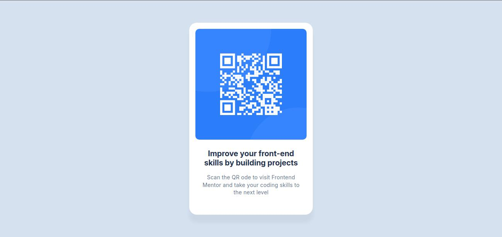

# Frontend Mentor - QR code component solution

This is a solution to the [QR code component challenge on Frontend Mentor](https://www.frontendmentor.io/challenges/qr-code-component-iux_sIO_H). Frontend Mentor challenges help you improve your coding skills by building realistic projects. 

## Table of contents

- [Overview](#overview)
  - [Screenshot](#screenshot)
  - [Links](#links)
- [My process](#my-process)
  - [Built with](#built-with)
  - [What I learned](#what-i-learned)
  - [Continued development](#continued-development)
  - [Useful resources](#useful-resources)
- [Author](#author)

## Overview

### Screenshot



### Links

- [Solution URL](https://your-solution-url.com)
- [Live site URL](https://qr-code-component-edson.netlify.app/)

## My process

### Built with

- Semantic HTML5 markup
- CSS custom properties
- Flexbox
- Mobile-first workflow

### What I learned

Base html code
```html
<main class="main">
  <div class="qr-card">
    <div class="qr-image"></div>
    <div class="qr-text">
      <h1 class="qr-title">Improve your front-end skills by building projects</h1>
      <p class="qr-paragraph">Scan the QR ode to visit Frontend Mentor and take your coding skills to the next level</p>
    </div>
  </div>
</main>
```
Style variables and main block to center content
```css
body {
  margin: 0;
  --slate-900: #1f314f;
  --slate-500: #68778d;
  --slate-300: #d5e1ef;
  --space-500: 40px;
  --space-300: 24px;
  --space-200: 16px;
}

.main {
  background-color: var(--slate-300);
  width: 100%;
  height: 100vh;
  display: flex;
  flex-direction: column;
  justify-content: center;
  align-items: center;
}
```

### Continued development

Still need to learn more about styling pages to make more efficient code, specially alternatives to flexbox for creating better responsive pages.

### Useful resources

- [How to create a card with css](https://www.geeksforgeeks.org/how-to-create-a-card-with-css/)
- [background-image property](https://www.w3schools.com/cssref/pr_background-image.php)

## Author

- Frontend Mentor - [@rodriguesedson](https://www.frontendmentor.io/profile/rodriguesedson)